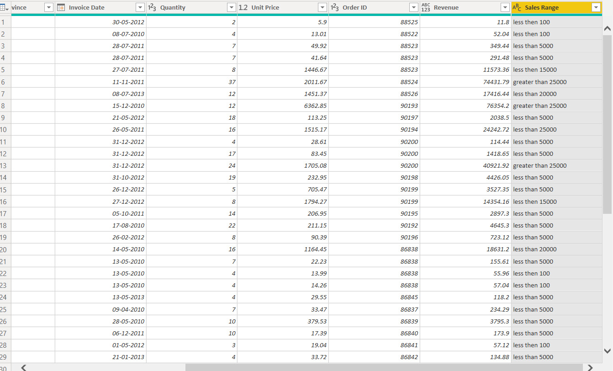
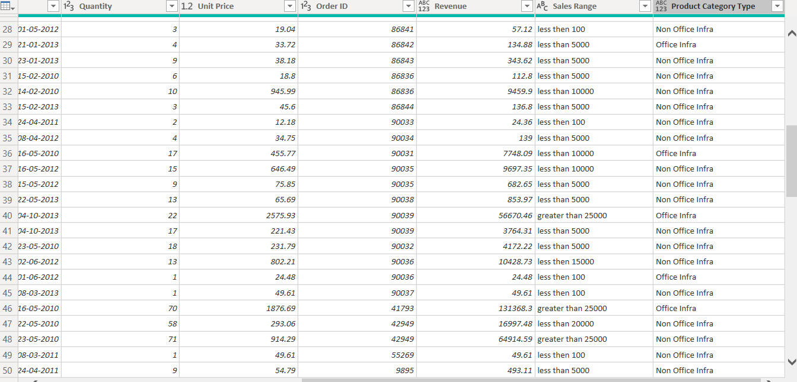
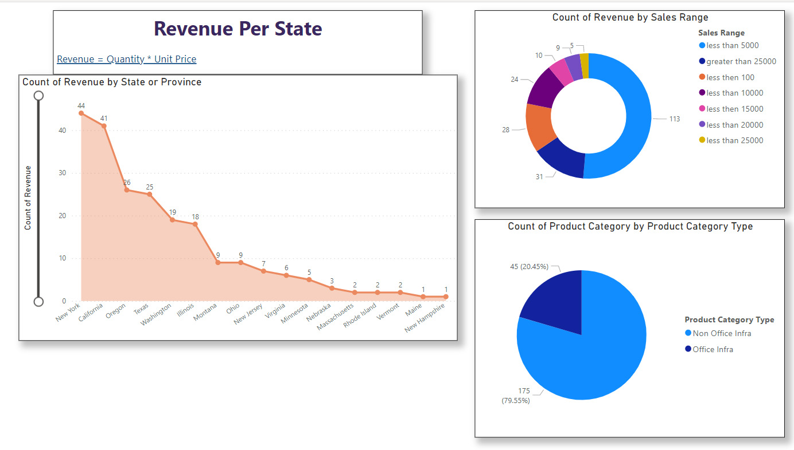

<html>
<body>

A new column was made to show the analysis on the Revenue of each state.

Revenue = Quantity * Unit Price

A New column got added named Sales Range to get the range of the revenue

Another column added Product Category Type where the Product categories are divided into Office Infra and Non Office Infra

The final charts with respect to the headings

</body>
</html>
